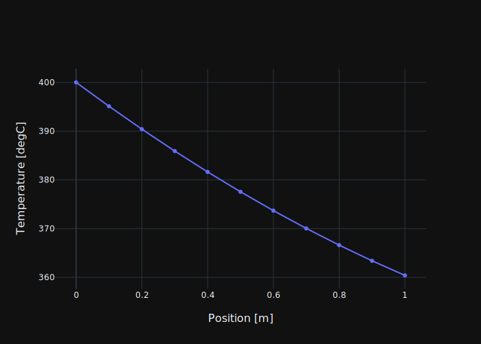
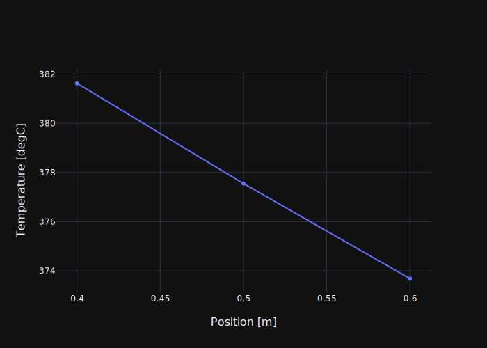
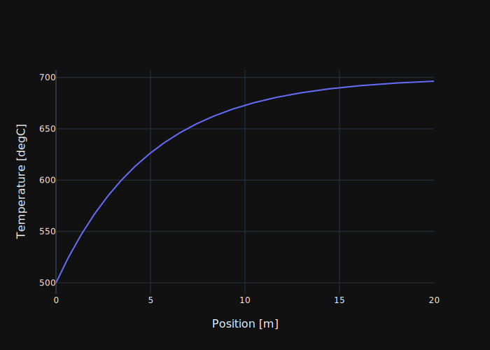
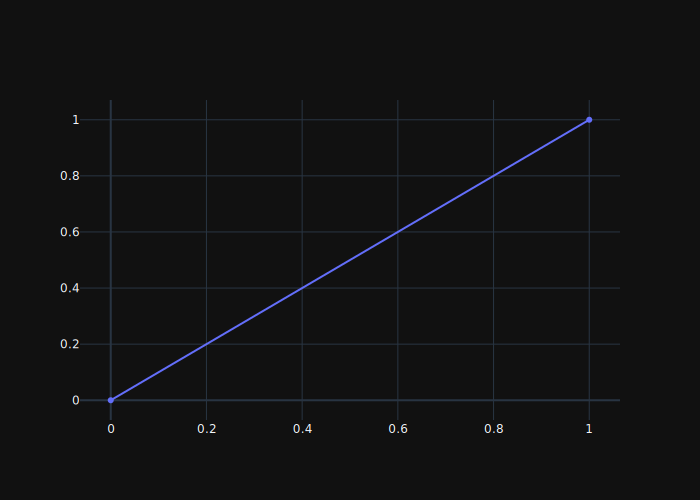
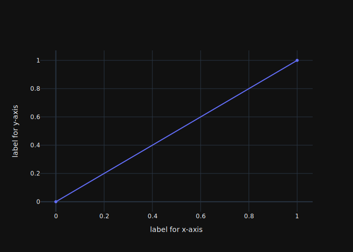
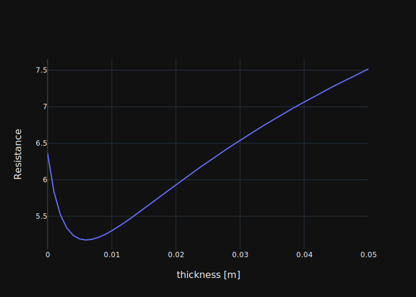
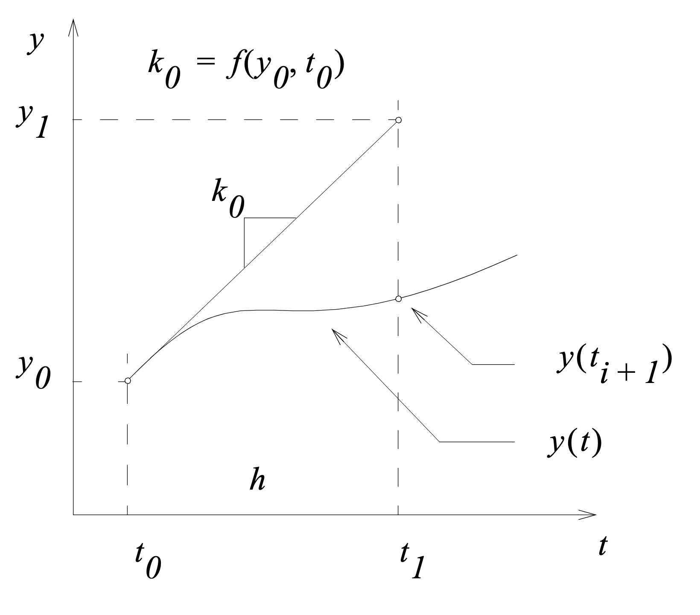
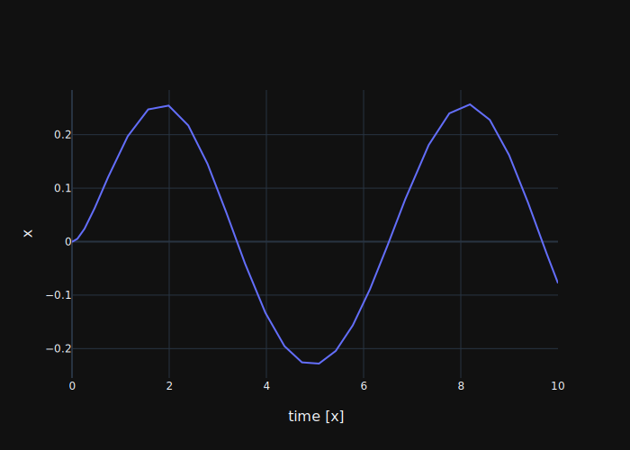
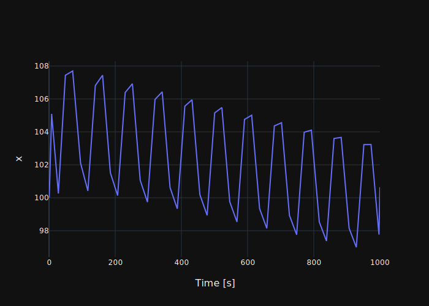
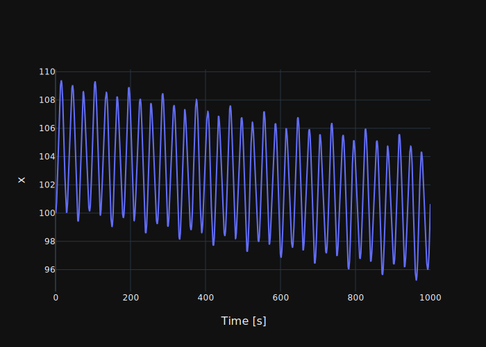

# Numerical Method in Python
Most of examples in this lecture is given as a Jupyter notebook. You can also solve your
exercises in the Jupyter notebook. Some of the exams questions will require you to use the same.
This means you will have to be familiar with solving the engineering problems with Python. Python
 is becoming a more and more popular both as a general programming language and as an engineering
  tool.

## Packages
Apart from the core functions and language syntax which comes when you install Python, you can
easily expand the capability of the language by installing packages usually provided as a open
source software. You can also build your own python packages and share it with others. The most
useful packages for solving general engineering problems are scipy and numpy.

### Installation of the package
Packages can be easily installed by
```commandline
pip install [package name, ...]
```
So, you can install scipy and numpy packages by
```commandline
pip install scipy, numpy
```
In some cases, you may have to manage many packages for a specific application. A simple way to
do it is to list the package in a text file (e.g. 'requirements.txt') and simply type
```commandline
pip install -r requirements.txt
```

### Virtual Environment
Each application may need to have a different set of packages. Furthermore, An applicaiton may
depend on a specific version of a package while other applications depend on another version. To
resolve these conflicts in versions and packages, it is recommended to use a virtual environment
for an application. Virtual environment, when it is activated, provides an isolated python
environment from others.

First, you have to install the virtual environment package if you haven't. I will assume that
you can enter 'python' in any directory to run Python.
```commandline
pip install virtualenv
```
Then you need to be in the directory of
the target directory.
```commandline
cd target_directory
```
Then, create a virtual environment.
```commandline
python -m virtualenv venv
```
This will create your virtual environment in 'venv' directory. Next you can activate the virtual
environment. If you are on Windows PC,
```commandline
venv\Script\activate
```
Otherwise,
```commandline
source venv/bin/activate
```
NB! Whenever you restarted the terminal, make sure that you activate the virtual environment using
the above command.

### Importing packages
In order to use the packages, we have to import the package in the module or notebook. When I say
 module, it refers to a file with extension of '.py' We will first import numpy.


```python
import numpy as np
```

You see that I imported numpy with aliased name "np" above. The aliasing may be omitted and you
can use numpy as a full name to use classes, functions, attributes of numpy package. We will try
to use numpy to print the value of $\pi$.


```python
print(np.pi)
```

    3.141592653589793


When you want to import a specific module, classes, functions or attributes from the package, you
 can do that using "from"


```python
from scipy.integrate import solve_ivp
from scipy.optimize import minimize_scalar, root
```

## Using Numpy
We will start exploring how to use numpy array. Numpy is the fundamental package for scientific
computing with Python. I use numpy to handle multi-dimensional arrays mostly.

### Create a numpy array
To create a numpy arrays,


```python
# 1d array
np_array_1d_from_list = np.array([1, 2, 3]) # Creating a 1D array from a list
np_array_1d_from_iterator = np.array(range(10)) # Creating a 1D array from an iterator
np_array_1d_from_random = np.random.random(10) # Creating a 1D array of 10 random numbers
np_array_1d_from_arange = np.arange(0, 10, 1) # Creating a 1D array from 0 to 1 with step of 1
np_array_1d_from_lin_space = np.linspace(start=0, stop=100, num=11) # Creating a 1D array by linspace
np_array_1d_zeros = np.zeros(10) # Creating a zero-vector of a length of 10.
np_array_1d_ones = np.ones(10) # Creating a one-vector of a length of 10.

print(f"From a list: {np_array_1d_from_list}")
print(f"From an iterator: {np_array_1d_from_iterator}")
print(f"Using a random function: {np_array_1d_from_random}")
print(f"Using an arange function: {np_array_1d_from_arange}")
print(f"Using a lin space function: {np_array_1d_from_lin_space}")
print(f"Using a zeros function: {np_array_1d_zeros}")
print(f"Using a ones function: {np_array_1d_ones}")
print("\n")

# 2d array
np_array_2d_from_list = np.array([[1, 2, 3],[4, 5, 6]])
np_array_2d_from_random = np.random.random([2, 5])
np_array_2d_from_meshgrid = np.meshgrid(
    np.linspace(0, 1, 11),
    np.linspace(1, 2, 11)
)

print(f"2D array from a list: \n {np_array_2d_from_list}")
print(f"Shape of the 2D array is : {np_array_2d_from_list.shape}")
print(f"2D array from the random function: \n {np_array_2d_from_random}")
print(f"2D array from the meshgrid function \n {np_array_2d_from_meshgrid}")
print(type(np_array_2d_from_meshgrid))
```

    From a list: [1 2 3]
    From an iterator: [0 1 2 3 4 5 6 7 8 9]
    Using a random function: [0.51462656 0.4611812  0.61464877 0.2688413  0.20823497 0.67954175
     0.19178084 0.99300547 0.22526408 0.60033815]
    Using an arange function: [0 1 2 3 4 5 6 7 8 9]
    Using a lin space function: [  0.  10.  20.  30.  40.  50.  60.  70.  80.  90. 100.]
    Using a zeros function: [0. 0. 0. 0. 0. 0. 0. 0. 0. 0.]
    Using a ones function: [1. 1. 1. 1. 1. 1. 1. 1. 1. 1.]
    
    
    2D array from a list: 
     [[1 2 3]
     [4 5 6]]
    Shape of the 2D array is : (2, 3)
    2D array from the random function: 
     [[0.04771196 0.46575961 0.28640024 0.56194939 0.14192946]
     [0.76916407 0.45188821 0.52630999 0.33041153 0.80564117]]
    2D array from the meshgrid function 
     [array([[0. , 0.1, 0.2, 0.3, 0.4, 0.5, 0.6, 0.7, 0.8, 0.9, 1. ],
           [0. , 0.1, 0.2, 0.3, 0.4, 0.5, 0.6, 0.7, 0.8, 0.9, 1. ],
           [0. , 0.1, 0.2, 0.3, 0.4, 0.5, 0.6, 0.7, 0.8, 0.9, 1. ],
           [0. , 0.1, 0.2, 0.3, 0.4, 0.5, 0.6, 0.7, 0.8, 0.9, 1. ],
           [0. , 0.1, 0.2, 0.3, 0.4, 0.5, 0.6, 0.7, 0.8, 0.9, 1. ],
           [0. , 0.1, 0.2, 0.3, 0.4, 0.5, 0.6, 0.7, 0.8, 0.9, 1. ],
           [0. , 0.1, 0.2, 0.3, 0.4, 0.5, 0.6, 0.7, 0.8, 0.9, 1. ],
           [0. , 0.1, 0.2, 0.3, 0.4, 0.5, 0.6, 0.7, 0.8, 0.9, 1. ],
           [0. , 0.1, 0.2, 0.3, 0.4, 0.5, 0.6, 0.7, 0.8, 0.9, 1. ],
           [0. , 0.1, 0.2, 0.3, 0.4, 0.5, 0.6, 0.7, 0.8, 0.9, 1. ],
           [0. , 0.1, 0.2, 0.3, 0.4, 0.5, 0.6, 0.7, 0.8, 0.9, 1. ]]), array([[1. , 1. , 1. , 1. , 1. , 1. , 1. , 1. , 1. , 1. , 1. ],
           [1.1, 1.1, 1.1, 1.1, 1.1, 1.1, 1.1, 1.1, 1.1, 1.1, 1.1],
           [1.2, 1.2, 1.2, 1.2, 1.2, 1.2, 1.2, 1.2, 1.2, 1.2, 1.2],
           [1.3, 1.3, 1.3, 1.3, 1.3, 1.3, 1.3, 1.3, 1.3, 1.3, 1.3],
           [1.4, 1.4, 1.4, 1.4, 1.4, 1.4, 1.4, 1.4, 1.4, 1.4, 1.4],
           [1.5, 1.5, 1.5, 1.5, 1.5, 1.5, 1.5, 1.5, 1.5, 1.5, 1.5],
           [1.6, 1.6, 1.6, 1.6, 1.6, 1.6, 1.6, 1.6, 1.6, 1.6, 1.6],
           [1.7, 1.7, 1.7, 1.7, 1.7, 1.7, 1.7, 1.7, 1.7, 1.7, 1.7],
           [1.8, 1.8, 1.8, 1.8, 1.8, 1.8, 1.8, 1.8, 1.8, 1.8, 1.8],
           [1.9, 1.9, 1.9, 1.9, 1.9, 1.9, 1.9, 1.9, 1.9, 1.9, 1.9],
           [2. , 2. , 2. , 2. , 2. , 2. , 2. , 2. , 2. , 2. , 2. ]])]
    <class 'list'>


Check out [this link](https://numpy.org/doc/stable/reference/routines.array-creation.html) for
various methods to create arrays.

#### Exercise
We are given with a function of temperature in <sup>o</sup>C in $x$ that is position in m,
$$T(x) = 400 - 50x + 10x^2 + 0.4x^3$$
Calculate the temperatures from x=0 to x=1 with an interval of 0.1 and plot it.


```python
# Exercise
from typing import Union
from plotly.subplots import make_subplots

# Define the function to get temperature
def get_temperature(x_position: Union[float, np.ndarray]) -> Union[float, np.ndarray]:
    return 400 - 50*x_position + 10*x_position**2 + 0.4*x_position**3

# Create a 1D array of x position
x_position_array = np.linspace(0, 1, 11) # Your code here

# Calculate the temperature
temperature_array = get_temperature(x_position_array)

# Plot

fig = make_subplots(column_widths=[800], row_heights=[600], x_title="Position [m]", y_title="Temperature [degC]")
fig.add_scatter(x=x_position_array, y=temperature_array)
fig.show(renderer="svg")
```


    

    


### Accessing the array
You can array a value in the array with the index. The first element in the array has index, 0.
You can access the last element with index, -1, ans the second last with -2, and so on.

#### Exercise
From the exercise above, what is the temperature at $x$=0 and $x=1$.


```python
temperature_x_0 = temperature_array[0]
temperature_x_1 = temperature_array[-1]

print(f"Temperature at x=0: {temperature_x_0} degC")
print(f"Temperature at x=1: {temperature_x_1} degC")
```

    Temperature at x=0: 400.0 degC
    Temperature at x=1: 360.4 degC


We can also access the array in range. For example, to access the first 3 elements


```python
print(x_position_array[:3])
```

    [0.  0.1 0.2]


We can also access the array toward the end. For example, to access the last 10 elemenents


```python
print(x_position_array[-3:])
```

    [0.8 0.9 1. ]


If you want to access something in between, from index 3 to 6, use the following.
```python
x_position_array[x:y]
```
Note that the `x_position_array[6]` is not inclusive here. You can also access the elemets by
conditions. To access the elements which has value that is greater than 0.5,


```python
index_array = x_position_array > 0.5
print(index_array)
print(x_position_array[index_array])
```

    [False False False False False False  True  True  True  True  True]
    [0.6 0.7 0.8 0.9 1. ]


#### Exercise
Plot the temperature graphs for 0.4<=$x$<=0.7. Use the output from the exercise above.
(Hint. Use `np.bitwise_and(x1, x2)` to get AND operation of two array of boolean values.)


```python
index_array = np.bitwise_and(x_position_array >= 0.4, x_position_array <= 0.7)
x_position_array_to_plot = x_position_array[index_array]
temperature_array_to_plot = temperature_array[index_array]

fig = make_subplots(column_widths=[800], row_heights=[600], x_title="Position [m]", y_title="Temperature [degC]")
fig.add_scatter(x=x_position_array_to_plot, y=temperature_array_to_plot)
fig.show(renderer="svg")
```


    

    


### Array operation
You can apply most of the arithmetic operations to the array.


```python
print(f"Multiplying an array with a scalar: {x_position_array * 10}")
print(f"Adding an array with a scalar: {x_position_array + 1}")
print(f"Squaring an array with a scalar: {x_position_array**2}")
```

    Multiplying an array with a scalar: [ 0.  1.  2.  3.  4.  5.  6.  7.  8.  9. 10.]
    Adding an array with a scalar: [1.  1.1 1.2 1.3 1.4 1.5 1.6 1.7 1.8 1.9 2. ]
    Squaring an array with a scalar: [0.   0.01 0.04 0.09 0.16 0.25 0.36 0.49 0.64 0.81 1.  ]


The same applies to functions.


```python
print(f"Sine of an array: {np.sin(x_position_array)}")
print(f"Exponential value of an array: {np.exp(x_position_array)}")
```

    Sine of an array: [0.         0.09983342 0.19866933 0.29552021 0.38941834 0.47942554
     0.56464247 0.64421769 0.71735609 0.78332691 0.84147098]
    Exponential value of an array: [1.         1.10517092 1.22140276 1.34985881 1.4918247  1.64872127
     1.8221188  2.01375271 2.22554093 2.45960311 2.71828183]


If you do the arithmetic for two arrays, the arithmetic happens element wise also.


```python
print(f"Adding two arrays: {x_position_array + x_position_array}")
print(f"Multiplying two arrays: {x_position_array * x_position_array}")
```

    Adding two arrays: [0.  0.2 0.4 0.6 0.8 1.  1.2 1.4 1.6 1.8 2. ]
    Multiplying two arrays: [0.   0.01 0.04 0.09 0.16 0.25 0.36 0.49 0.64 0.81 1.  ]


## Using Functions and Partial Functions
Function allows you to use the algorithm or calculations repetitively without writing it
over and over. Whenever you realize that a piece of code is used more than once, it is a good
 idea to implement it as a function. Sometimes you want to change the algorithm or correct a bug.
  Then you only have to correct once in the function.

### Defining a function
Here's a basic syntax for defining a function
```python
def function_name(arg1, arg2, arg3):
    something = arg1 + arg2 + arg3
    return something
```
You can define a function in any place of the module. Usually you define a function before its
usage. You can define a function within a function. In that case, the function is only usable
within the wrapping function.

A function must have a name. In modern programming, we are not so eager to use abbreviation. We
would rather use a name that is understood to anyone. So don't squeeze your head to find a short
function name with a lot of abbreviations but just use more daily words.

A function takes arguments. You can make a function without any argument also. Argument can be
anything, really. It can be a numeric value, string, or even a function. You can pass an instance
of a class or class type.

A function always returns a value. If you don't specify anything, the function returns None.

#### Exercise
Create a function for the temperature change over time.
$$T(t) = T_0 + T_\mathrm{rise}\left(1 - e^{-\frac{t}{tau}}\right)$$
Plot a graph for $0 \leq t \leq 20$ given $\tau=5$, $T_0$ = 500 and  $T_\mathrm{rise}$ = 200.


```python
Numeric = Union[float, np.ndarray]

def get_temperature(
        time: Numeric,
        initial_temperature: Numeric,
        rise_temperature: Numeric,
        tau: Numeric
) -> Numeric:
    return initial_temperature + rise_temperature * (1 - np.exp(-1 / tau *  time))

time_array = np.linspace(0, 20, 201)
temperature_array = get_temperature(
    time=time_array,
    initial_temperature=500,
    rise_temperature=200,
    tau=5
)

fig = make_subplots(column_widths=[800], row_heights=[600], x_title="Position [m]", y_title="Temperature [degC]")
fig.add_scatter(x=time_array, y=temperature_array)
fig.show(renderer="svg")
```


    

    


### Typing hint
It is a good idea to provide the hint for the types that you expect for the argument and return
values when you implement a function. It makes the use of function easier and people don't have
to do trial and error to see which data type the function can accept. The following syntax is
used to give the typing hint.
```python
def function(arg1: type1, arg2: type2) -> return_type:
    return value
```
A type can be a built-in types such as `int`, `float`, `list`, etc, or it can be a class or
function.

If the value can take more than one type, then you can use `Union` that you can import from
typing package.

```python
from typing impot Union

def function(arg1: Union[type1, type2], arg2: Union[type1, type2]) -> return_type:
    return value
```

### Partial function
Partial function is used when you need to freeze some arguments when a function is used. It is like
defining a new function that calls the function you wan to use. For example,
```python
def add_two_values(x, y):
    return x, y

def add_two_to_a_value(x):
    return add_two_values(x, 2)
```
Instead of defining a new function,
```python
from functools import partial

add_two_to_a_value = partial(add_two_values, y=2)
```
This improves the readability of the function. This can be effectively used in other functions
that takes a function as an argument. We will see the examples in the numerical optimization
section or numerical integration section.
## Plotting results
matplotlib is a basic package everyone uses when they want to plot numerical values in Python.
There are other high-level packages that provides templates for more advanced plots such as
Plotly or Seaborn.

#### Exercise
Create a function that accept only temperature as an input using `partial` for `get_temperature` function from the previous exercise. Other arguments are given as $0 \leq t \leq 20$ given $\tau=5$, $T_0$ = 500 and  $T_\mathrm{rise}$ = 200.
Check if they give the same value for at any random t value.


```python
from functools import partial
import random

get_temperature_only_from_time_input = partial(
    get_temperature,
    initial_temperature = 500,
    rise_temperature=200,
    tau=5
)

time = random.random() * 100
assert get_temperature(
    time,
    initial_temperature=500,
    rise_temperature=200,
    tau=5
) == get_temperature_only_from_time_input(time), "The partial function is not identical."
```

### Creating plot
First the package for plotting should be imported. This is how everyone does.


```python
from plotly.subplots import make_subplots
```

`plt.plot(x, y)` is the easiest way to start.


```python
fig = make_subplots()
fig.add_scatter(x=[0, 1], y=[0, 1])
fig.show(renderer="svg")
```


    

    


We usually want to have control over different elements in the plot such as legends, labels,
range, colors, line styles, etc. These are usually handled through axes instance. So, we can
start plotting by creating a figure and axes that belongs to the figure.


```python
fig = make_subplots()
fig.add_scatter(x=[0, 1], y=[0, 1])
fig.update_xaxes(title="label for x-axis")
fig.update_yaxes(title="label for y-axis")
fig.show(renderer="svg")
```


    

    


## Numerical Optimization
Numerical optimization in this course is used in two ways in this course:
- Finding a root for an equation $f(x) = 0$
- Finding a minimum value and the corresponding argument for an objective function

### Solving an equation
We can use `root` method from `scipy.optimize` to find a root for a equation $f(x) = 0$ where $x$
 is a vector. The syntax for using the method is
```python
root(fun, x0, args=(), method='hybr', jac=None, tol=None, callback=None, options=None)
```
fun, x0 must be given, and other arguments are optional. fun is a Python function of which the
return is supposed to be 0 (left side of the equation). x0 is a ndarray or list for the initial
guess for the solution. Here is a simple example for a second-order polynomial to solve.
$$ f(x) = x^2 - 5x  + 6 = 0$$


```python
from scipy.optimize import root_scalar

# Setting the function to solve
def function_to_solve(x: float) -> float:
    return x**2 - 5*x + 6

solution = root_scalar(function_to_solve, x0=0, x1=0.1)
print(solution)
```

          converged: True
               flag: 'converged'
     function_calls: 10
         iterations: 9
               root: 2.0000000000000004


Note that only one solution is found from the solver. We can try again with a new initial guess.


```python
solution = root_scalar(function_to_solve, x0=5, x1=5.1)
print(solution)
```

          converged: True
               flag: 'converged'
     function_calls: 10
         iterations: 9
               root: 2.9999999999999987


Now we found the other solution. Be aware of that the solution may not be found depending on the
initial guess or it gives another solution that you did not expect. It is a good practive to try
the method with different initial values to avoid such a surprise.

#### Exercise
Find the time at which the temperature has reached 626.4<sup>o</sup>C using the partial function 
from the previous exercise.


```python
# We need to define a function to solve
def function_to_solve(time: Numeric) -> Numeric:
    return get_temperature_only_from_time_input(time) - 626.4

solution = root_scalar(function_to_solve, x0=0, x1=0.1)
print(solution)

# We can verify if the solution is correct
assert 626.4 == get_temperature_only_from_time_input(solution.root), "The solution is not correct"
```

          converged: True
               flag: 'converged'
     function_calls: 9
         iterations: 8
               root: 4.998361704066028


### Find a minimum value
In this course, we will only look at a scalar function with a single variable. To do that, we can
 use `minimize_scalar` function from `scipy.optimize`. The syntax is

```python
minimize_scalar(fun, bracket=None, bounds=None, args=(), method='brent', tol=None, options=None)
```
Here, we have to pass a function with a single variable. Often, we need to bound the search area
so that the algorithm does not search the solution in the unexpected region. In that case, it is
recommended to use 'bounded' method. Let us recall the function we used for finding the thermal
resistance for an insulated pipe.


```python
def get_total_thermal_resistance_cylinder_with_insulation(
    wall_thickness: Numeric,
    inner_radius: Numeric,
    thermal_conductivity: Numeric,
    convection_coefficient: Numeric,
    length: Numeric
) -> Numeric:
    """Returns total thermal resistance"""
    outer_radius = inner_radius + wall_thickness
    resistance_insulation = np.log(outer_radius / inner_radius) / \
                            (2 * np.pi * thermal_conductivity * length)
    outer_area = 2 * np.pi * outer_radius * length
    resistance_convection =  1 / (convection_coefficient * outer_area)
    return resistance_insulation + resistance_convection
```

In this function, the wall thickness should be always greater than 0. There is no meaning to
search the function with negative values of the wall thickness. Therefore, we use `bounded` as a
method finding the minimum value.

#### Exercise
Create a `function_to_minimize` from `get_total_thermal_resistance_cylinder_with_insulation` with
 the wall_thickness as an input. Other values are given as $r_i$ = 5 mm, $k_\mathrm{insulation}$
 =  0.055 W/mK, $h_\mathrm{surr}$ = 5 W/m<sup>2</sup>K, length = 1m. Then use the
 `minimize_scalar` function to find the minimum value for the function in the thickness between 0
  and 100mm.


```python
from scipy.optimize import minimize_scalar

function_to_minimize = partial(
    get_total_thermal_resistance_cylinder_with_insulation,
    inner_radius=0.005,
    thermal_conductivity=0.055,
    convection_coefficient=5,
    length=1
)

thickness_array = np.linspace(0, 0.05, 51)
resistance_total_array = function_to_minimize(thickness_array)
fig = make_subplots(x_title="thickness [m]", y_title="Resistance")
fig.add_scatter(x=thickness_array, y=resistance_total_array)
fig.show(renderer="svg")


solution = minimize_scalar(function_to_minimize, bounds=(0, 0.1), method='bounded')
print(solution)
```


    

    


     message: Solution found.
     success: True
      status: 0
         fun: 5.175305989335323
           x: 0.005999939767216146
         nit: 12
        nfev: 12


## Numerical Integration / Solving ODE
Often, we get an differential equation for our engineering problem, especially when we need to
handle temporal changes. In many cases, we end up with an ordinary differential equation that
looks like
$$\dot{x} = f(x, t)$$
When the differential function is in this form, we call it ordinary differential equation (ODE).
Other form of the differential equation is
$$f(x, \dot{x}, t) = 0$$
which is called a differential algebraic equation.
For ODE, $x(t)$ is found by
$$x(t) = x(0) + \int_0^t f(x, \tau) d\tau$$
This integration can be done numerically. You can think of Simpson's rule, for example, as an
integrator for the given function. Only the difference is that for Simpson's rule we know all the
values of the function to integrate whereas we need to guess the next value of the function from
the current value and the gradient. See below figure for the scheme of the Eulers method which is
in the simplest form of the ODE solver.
<p style="text-align: center">
    
</p>

### Using solve_ivp
Once you set up a function for the derivative of the states, we can use the ODE solver in the
python. The most generic method to use is `solve_ivp` from `scipy.integrate`. The syntax of the
method is
```python
solve_ivp(fun, t_span, y0, method='RK45', t_eval=None, dense_output=False, events=None,
vectorized=False, args=None, **options)
```
Here `fun` argument is the derivative function $\dot{x}$ as a function of $t$ and $x$. The first
argument of the function should be time and the second $x$. `t_span` is the time interval of the
integration given as a tuple, `(t_start, t_end)`. It returns an ODEResult object which has the
following attributes:
- `t`: Time points
- `z`: Values of the solution at `t`
- `success`: True if the solver reached the interval end or a termination event occurred
(``status >= 0``)
- others

#### Example
Solve the differential equation
$$\dot(x) = x^2 - 4x + sin(t)$$
for $x(0) = 0$ and $0 \leq t \leq 10$ and plot the result


```python
from scipy.integrate import solve_ivp

def diff_equation_to_solve(time, x):
    return x**2 - 4*x + np.sin(time)
x0 = 0
solution = solve_ivp(diff_equation_to_solve, (0, 10), [x0])

fig = make_subplots(x_title="time [x]", y_title="x")
fig.add_scatter(x=solution.t, y=solution.y[0])
fig.show(renderer="svg")
```


    

    


####Exercise
We have the rate of change in temperature equation given for a control volume.
$$\dot{T} = \dot{Q}_t-\frac{h \cdot A}{m c_p}\left(T - T_\mathrm{surr}\right)$$

First, create a function for $\dot{T}$ in function of $T$ and $t$. $\dot{Q}_t$ is also a
function in time that can be defined later. This means that the function for $\dot{T}$ should
take $\dot{Q}_t$ function an additional argument.


```python
# Your code here
from typing import Callable

def temperature_rate(
        time: Numeric,
        temperature: Numeric,
        heat_input: Callable[[Numeric], Numeric],
        heat_transfer_coefficient: float,
        area: float,
        mass: float,
        c_p: float,
        surrounding_temperature: float,
) -> Numeric:
    return heat_input(time) - \
           heat_transfer_coefficient * area / (mass * c_p) * (temperature - surrounding_temperature)
```

Given 
- $\dot{Q}_t = sin(0.209t)$
- $h$=2 W/m<sup>2</sup>
- $A$=100 m<sup>2</sup>
- $m$=1000 kg
- $c_p$=300J/kgK
- $T_\mathrm$ = 20 <sup>o</sup>C, define a function to solve and solve the differential
equation for $T_0 = 100$, $0 \leq t \leq 100$.


```python
def heat_input(time: Numeric) -> Numeric:
    return np.sin(0.209*time)

function_to_solve = partial(
    temperature_rate,
    heat_input=heat_input,
    heat_transfer_coefficient=2,
    area=100,
    mass=10000,
    c_p=300,
    surrounding_temperature=20
)

solution = solve_ivp(function_to_solve, (0, 1000), [100])

fig = make_subplots(x_title="Time [s]", y_title="x")
fig.add_scatter(x=solution.t, y=solution.y[0])
fig.show(renderer="svg")
```


    

    


Since the output seems to be a bit coarse, we want to see the result in a finer grid.


```python
t_eval = np.linspace(0, 1000, 10001)
solution = solve_ivp(function_to_solve, (0, 1000), [100], t_eval=t_eval)

fig = make_subplots(x_title="Time [s]", y_title="x")
fig.add_scatter(x=solution.t, y=solution.y[0])
fig.show(renderer="svg")
```


    

    


## Further dive into the scientific calculation with python

Please refer to [Scypy Lecture Notes](https://scipy-lectures.org/index.html) if you want to find
more about the scipy and numpy.

Here are more packages that might be interesting for other application.
1. [pandas](https://pandas.pydata.org): data analysis and manipulation tool
2. [SymPy](https://www.sympy.org/en/index.html): Python library for symbolic mathematics.
2. [scikit-learn](https://scikit-learn.org/stable/index.html): open source machine learning
library that supports supervised and unsupervised learning.
3. [keras](https://keras.io): library that provides a Python interface for artificial neural
networks using TensorFlow.

