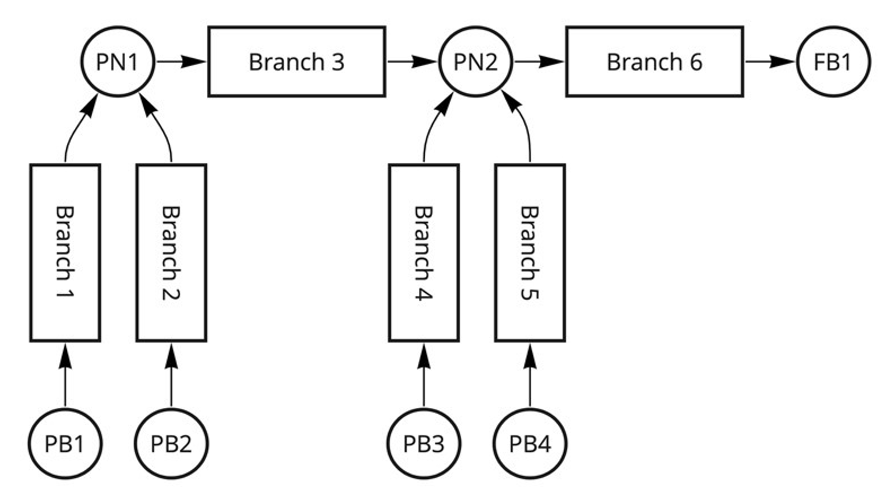
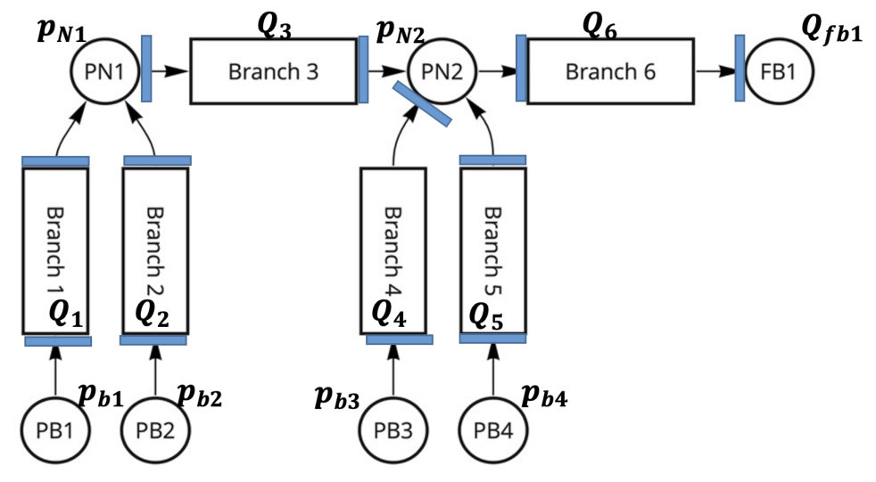

# Pipe Network Analysis

Calculate the pressure at the nodes and flow in the pipes for the following pipe network in which water flows. The pipe sizes and pressure / flow boundary conditions are given as follows:

<p style="text-align: center">
    
</p>

| Branch id | Nominal Diameter | Length |
|:---------:|:----------------:|:------:|
|     1     |       400        |   20   |
|     2     |       400        |   25   |
|     3     |       500        |   15   |
|     4     |       400        |   24   |
|     5     |       400        |   24   |
|     6     |       600        |   30   |


- \\(p_{b1}\\) = 175000 Pa, \\(p_{b2}\\) = 175000 Pa, \\(p_{b3}\\) = 178000 Pa, \\(p_{b4}\\) = 178000 Pa,
- \\(Q_{fb}\\) = 1.5 m3/s
- Roughness of the pipe is 2e-5
- Pipe schedule is 40


```python
# First import the packages
from fluids import friction, core, fittings
from fluids.piping import nearest_pipe
from pyfluids import Fluid, FluidsList, Input
import numpy as np
from scipy.optimize import root_scalar, root
```


```python
# Property
water = Fluid(FluidsList.Water).with_state(Input.pressure(1e5), Input.temperature(20))

# The boundary conditions
q_fb1 = 1.5 # m3/s
mass_flow_fb1_kg_per_s = q_fb1 * water.density
p_b1 = 1.75e5 # Pa g
p_b2 = 1.75e5 # Pa g
p_b3 = 1.78e5 # Pa g
p_b4 = 1.78e5 # Pa g

# Pipe dimenstions and roughness
nominal_dia_list_m = [0.400, 0.400, 0.500, 0.400, 0.400, 0.600]
inner_dia_list_m = []
for nominal_dia in nominal_dia_list_m:
    nps, d_inner, d_outer, t = nearest_pipe(Di=nominal_dia, schedule="40")
    inner_dia_list_m.append(d_inner)
length_list_m = [20, 25, 15, 24, 24, 30]
roughness = 2e-5
```

We can assign the causality to the branches. 
<p style="text-align: center">
    
</p>

## Equation Writing

Then, we can start writing the equations in the following form.

$$
\begin{aligned}
p_{n1} = f_1(p_{n1}, p_{n2})\\
p_{n2} = f_2(p_{n1}, p_{n2})
\end{aligned}
$$

$$
\begin{aligned}
p_{n1} & = p_{n2} + \Delta p (Q_3)\\
       & Q_3 = Q_1 + Q_2\\
       & Q_1 = Q_1\left(p_{b1} - p_{n1}\right)\\
       & Q_2 = Q_2\left(p_{b2} - p_{n1}\right)  \\     
p_{n2} & = p_{b3} - \Delta p (Q_4)\\
       & Q_4 = Q_6 - Q_3 - Q_5\\
       & Q_6 = Q_{fb1}\\
       & Q_5 = Q_5\left(p_{b4} - p_{n2}\right)
\end{aligned}
$$

First, we will make a function that calculates pressure drop with a given flow.


```python
def get_pressure_drop_pa(
    flow_kg_per_s: float,
    branch_id: int
) -> float:    
    """Calculates pressure drop given the flow"""
    return friction.one_phase_dP(
        m=flow_kg_per_s,
        rho=water.density,
        roughness=roughness,
        mu=water.dynamic_viscosity,
        D=inner_dia_list_m[branch_id - 1],
        L=length_list_m[branch_id - 1]
    )
```

## Initial values
We need the initial values to solve the equations. We will assume the same flow for branches 1, 2, 4, 5.


```python
mass_flow_init = np.zeros(6)
mass_flow_init[5] = mass_flow_fb1_kg_per_s
mass_flow_init[4] = mass_flow_init[5] * 0.25
mass_flow_init[3] = mass_flow_init[5] * 0.25
mass_flow_init[2] = mass_flow_init[5] * 0.5
mass_flow_init[1] = mass_flow_init[5] * 0.25
mass_flow_init[0] = mass_flow_init[5] * 0.25

p_init = np.zeros(2)
p_init[1] = p_b3 - get_pressure_drop_pa(flow_kg_per_s=mass_flow_init[3], branch_id=4)
p_init[0] = p_init[1] + get_pressure_drop_pa(flow_kg_per_s=mass_flow_init[2], branch_id=3)

print("Initial_flows for pipes [kg/s]:")
for index, q_each in enumerate(mass_flow_init):
    print(f"\t{index + 1} - {q_each:.2f}")

print("Initial pressure for nodes [Pa]:")
for index, p_each in enumerate(p_init):
    print(f"\t{index + 1} - {p_each:.0f}")
```

    Initial_flows for pipes [kg/s]:
    	1 - 374.33
    	2 - 374.33
    	3 - 748.65
    	4 - 374.33
    	5 - 374.33
    	6 - 1497.31
    Initial pressure for nodes [Pa]:
    	1 - 176914
    	2 - 175648


We will define the flow function for a pipe section as well. It has to be solved by a numerical solver to get the exact solution.


```python
def get_flow_kg_per_s(
    pressure_drop_pa: float,
    branch_id: int,
) -> float:
    """Calculates flow given the pressure drop for the pipe"""
    def function_to_solve(flow_guess):
        return pressure_drop_pa - get_pressure_drop_pa(
            flow_kg_per_s=flow_guess,
            branch_id=branch_id
        )
    sol = root_scalar(
        f=function_to_solve, 
        x0=mass_flow_init[branch_id - 1], 
        x1=mass_flow_init[branch_id - 1] * 0.9
    )
    return sol.root
```

Then we can define the functions to get the pressure at the node from the guess values for them as given by the system equations.


```python
def get_mass_flow3(p_n1_init, p_n2_init):
    mass_flow1 = get_flow_kg_per_s(pressure_drop_pa=p_b1 - p_n1_init, branch_id=1)
    mass_flow2 = get_flow_kg_per_s(pressure_drop_pa=p_b2 - p_n1_init, branch_id=2)
    return mass_flow1 + mass_flow2

def get_p_n1(p_n1_init, p_n2_init):
    return p_n2_init + get_pressure_drop_pa(
        flow_kg_per_s=get_mass_flow3(p_n1_init, p_n2_init),
        branch_id=3
    )

def get_p_n2(p_n1_init, p_n2_init):
    pressure_drop = p_b4 - p_n2_init
    mass_flow5 = get_flow_kg_per_s(pressure_drop_pa=pressure_drop, branch_id=5)
    mass_flow4 = mass_flow_fb1_kg_per_s - get_mass_flow3(p_n1_init, p_n2_init) - mass_flow5
    return p_b3 - get_pressure_drop_pa(
        flow_kg_per_s=mass_flow4,
        branch_id=4
    )
```

Then, the equation to solve becomes:


```python
def system_equation_to_solve(p_array: np.ndarray) -> np.ndarray:
    p_estimate_array = np.array([
        get_p_n1(p_array[0], p_array[1]),
        get_p_n2(p_array[0], p_array[1])
    ])
    return p_array - p_estimate_array

solution = root(system_equation_to_solve, x0=np.array(p_init), method='hybr')
p_sol = solution.x

# Calculate all the flows again
q_sol = np.zeros(6)
q_sol[0] = get_flow_kg_per_s(pressure_drop_pa=p_b1 - p_sol[0], branch_id=1)
q_sol[1] = get_flow_kg_per_s(pressure_drop_pa=p_b2 - p_sol[0], branch_id=2)
q_sol[2] = q_sol[0] + q_sol[1]
q_sol[5] = mass_flow_fb1_kg_per_s
q_sol[4] = get_flow_kg_per_s(pressure_drop_pa=p_b4 - p_sol[1], branch_id=5)
q_sol[3] = q_sol[5] - q_sol[2] - q_sol[4]
q_sol /= water.density

# Calculate the pressure at FB1 also
p_fb1 = p_sol[1] - get_pressure_drop_pa(flow_kg_per_s=mass_flow_fb1_kg_per_s, branch_id=6)

print("Pressure at nodes [Pa]:")
for index, p_each in enumerate(p_sol):
    print(f"\t{index + 1} - {p_each:.0f}")
print("Flow in branches [m3/s]:")
for index, q_each in enumerate(q_sol):
    print(f"\t{index + 1} - {q_each:.3f}")
print(f"Back pressure at the flow boundary is {p_fb1:.3f} Pa.")
```

    Pressure at nodes [Pa]:
    	1 - 174129
    	2 - 173626
    Flow in branches [m3/s]:
    	1 - 0.243
    	2 - 0.216
    	3 - 0.459
    	4 - 0.520
    	5 - 0.520
    	6 - 1.500
    Back pressure at the flow boundary is 171526.170 Pa.

