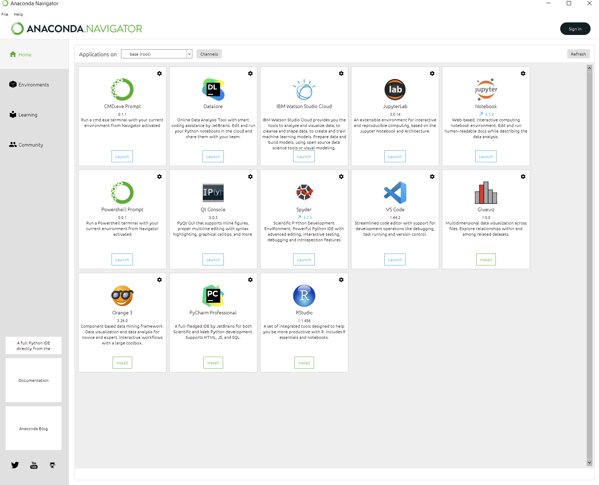
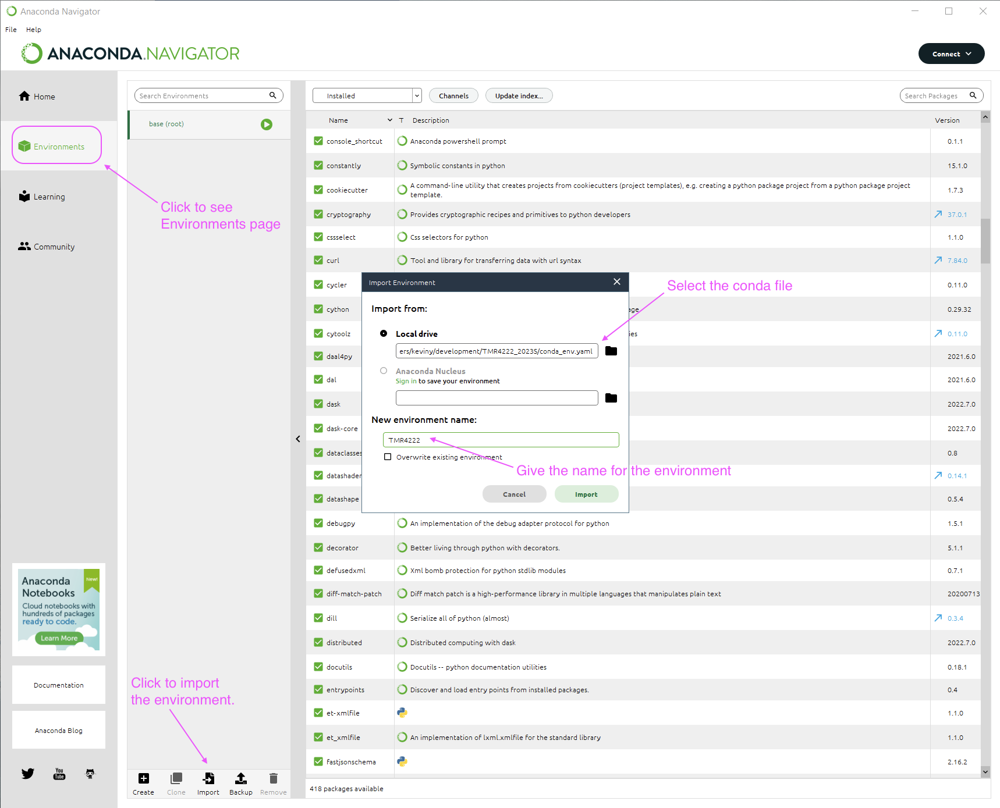
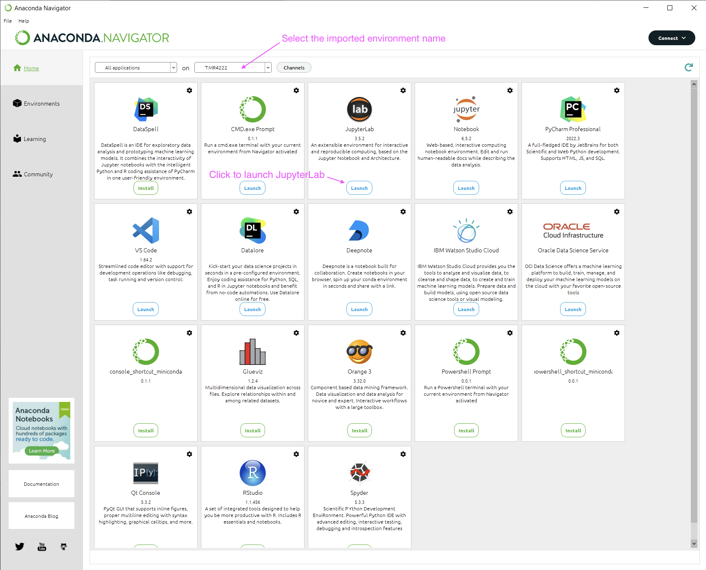

# Python with Anaconda
We will use Python with Anaconda for some of our exercises. Benefit of using Anaconda distribution
of Python instead of pure Python is that it comes with many useful packages pre-installed and 
it is easy to install new packages. In addition, it provides a uniform environment for all
students. It is fine to use other Python distributions that you are used to, but, if you are
a beginner, we recommend to use Anaconda.

Contents
- [How to install](#how-to-install--update-python-with-anaconda)
- [Clone the repository](#clone-the-repository)
- [Set up the environment](#set-up-the-environment)
- [Resources](#resources)

## How to install / Update Python with Anaconda
### Installing Anaconda
1. Download the Anaconda installer for your operating system from [here](https://www.anaconda.com/download/).
2. Run the installer. Follow the instructions on the screen.
3. Open a terminal and type `conda --version`. If you see the version number, you have successfully
installed Anaconda. Or 

Refer to the [official documentation](https://docs.anaconda.com/anaconda/install/) for more
details.

### Anaconda Navigator
you can try to run `Anaconda-Navigator` from the start menu to in Windows
or from the Applications folder in Mac OS to have more interactive experience. Among others, 
we will use `Jupyter Lab` for our course. You can also open an Anaconda Prompt from the `Anaconda-Navigator`.



### Updating Anaconda
If you already have Anaconda installed, you should check your version of Python. First, open
the `CMD.exe Prompt` or `Terminal` from the `Anaconda-Navigator`. Then type
```bash
python --version
```
If it says `Python 3.9.X` or higher, you are good to go. Otherwise, you need to update your
Anaconda installation. To do so, try the following:
```bash
conda update conda
conda update anaconda
python --version
```
If it didn't work, try to uninstall Anaconda and install it again. Refer to the [official documentation](https://docs.anaconda.com/anaconda/install/update-version/).

## Clone the repository
All the materials related to Python exercise in the course is available in the [GitHub repository](https://github.com/kevinksyTRD/TMR4222_2023S).
I recommend you to start using `git` for version control. It is a very useful tool for software
development. If you don't want to use `git`, you can download the repository as a zip file.

To clone the repository in your PC, open a terminal or command line and type
```bash
cd desired_folder_to_clone_the_repository
git clone https://github.com/kevinksyTRD/TMR4222_2023S.git
```
:::warning
You should use an actual folder name instead of `desired_folder_to_clone_the_repository`.
:::
It will create a folder named `TMR4222_2023S` in your `desired_folder_to_clone_the_repository`.
If you don't have `git` installed, you can install it from [here](https://git-scm.com/downloads).

## Set up the environment
When you cloned the repository or downloaded it and unzipped it, you will see a file named 
`conda_env.yaml`. You need to import this file to your Anaconda environment. To do so, open
`Anaconda-Navigator` and click on `Environments` in the side bar. 
Then click on `Import` button and select the file in the dialog box. Give a name to the environment
such as `TMR4222`. Then click on `Import` button. It will take a while to create the environment.

After it is done, go to your main page of `Anaconda-Navigator` and select the created environment
from the drop-down menu. Then click on `Launch` button to open `JupyterLab`. It will open a
browser window. You can navigate to the folder where you cloned the repository and open the
notebooks.




## Resources
[Github repository](https://github.com/kevinksyTRD/TMR4222_2023S.git)
[Anaconda documentation](https://docs.anaconda.com/anaconda/)
[JupyterLab documentation](https://jupyterlab.readthedocs.io/en/stable/)